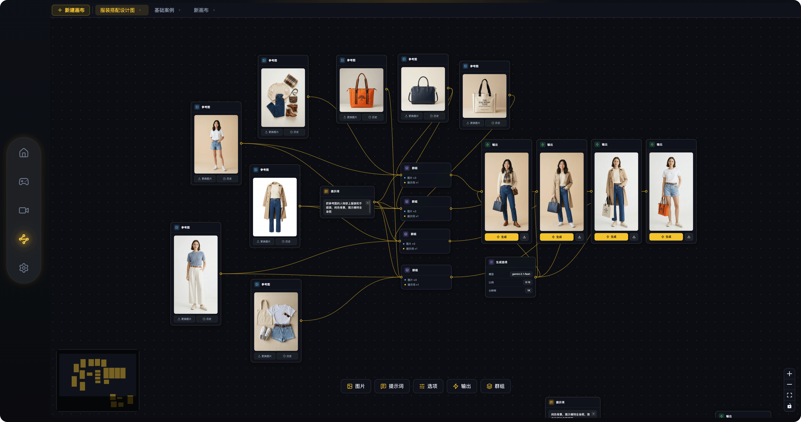
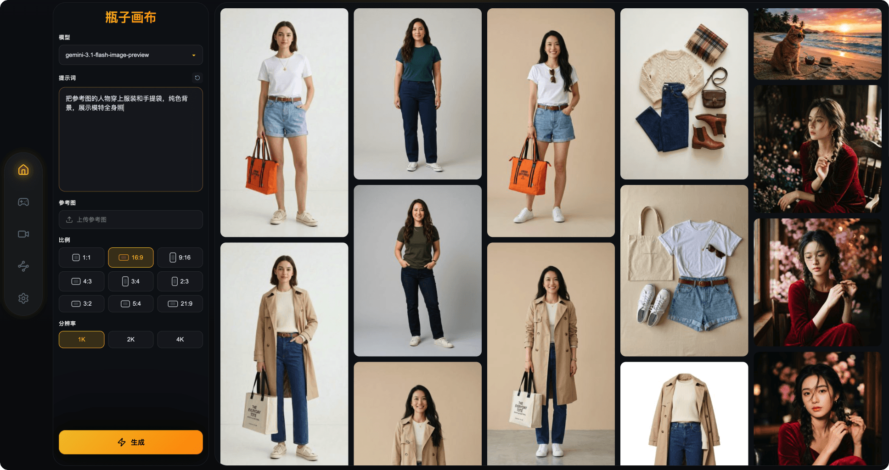

# 瓶子画布

一款基于 Chrome 扩展的 AI 图片生成工具，让你的新标签页充满创意。

## ✨ 产品特色

### 🎨 一键生成精美图片
- 打开新标签页即可快速生成 AI 图片
- 支持多种风格和主题
- 高质量图片输出

### 🚀 极简设计体验
- 暗黑模式界面，护眼舒适
- 简洁直观的操作流程
- 无需复杂配置，开箱即用

### 📊 完善的数据管理
- 实时用量统计，掌握使用情况
- 支持按日/周/月查看调用数据
- 成功率分析，优化使用体验

### 🔒 隐私安全保护
- 所有数据本地存储，不上传服务器
- API 密钥安全保存在浏览器本地
- 不收集用户个人信息

### ⚡ 高性能引擎
- 基于 BananaRouter 强大的 AI 引擎
- 快速响应，流畅体验
- 支持大量并发请求

## 📄 隐私政策

[查看隐私政策](https://github.com/sampinnpinn/BottleNode/blob/main/PRIVACY.md)

## 🌟 使用场景

- 桌面壁纸生成
- 创意灵感获取
- 社交媒体配图
- 艺术创作辅助

## 💡 快速开始

1. 安装扩展后，打开新标签页
2. 输入你的描述或选择预设风格
3. 点击生成，等待图片完成
4. 下载或保存你喜欢的作品

---

让每一次新标签页的打开，都成为一次创意的开始。
